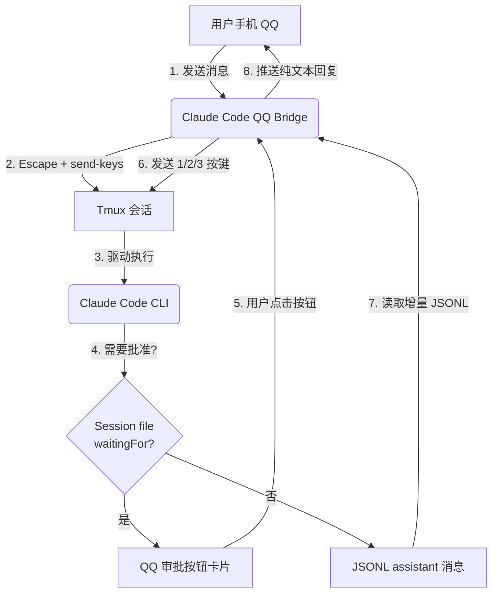

# Claude Code QQ Bridge 🚀

[](https://www.python.org/)
[](LICENSE)
[](https://bot.q.qq.com/)

**Claude Code QQ 桥接网关** — 通过 QQ 官方 WebSocket 网关直连 Claude Code（tmux 交互常驻），支持审批按钮、多轮对话、上下文续接。

---

## 🌟 核心解决痛点

在传统的终端桥接方案中，AI CLI 交互式终端给外部集成带来极高阻碍。本项目针对以下大坑进行了解决方案设计：

1. **控制字符与终端乱码**
   - **痛点**：截取终端屏幕输出会产生大量 ANSI 控制字符，发送到 QQ 全是不可读乱码。
   - **解决**：采用 **JSONL 结构化日志增量读取**，只提取纯净的 `assistant` 文本，输出无任何控制符的纯文本消息。

2. **物理终端焦点被夺**
   - **痛点**：Shell 拼接长指令可能因语法错乱令进程卡死；弹窗霸占键盘焦点导致消息注入失败。
   - **解决**：发送前先发 `Escape` 闭合弹窗，采用 tmux `send-keys` 参数式投递。

3. **黑盒审批不可控**
   - **痛点**：Claude Code 执行危险命令时弹出终端交互确认，外部程序无法可靠判断是否在等批准。
   - **解决**：读取 Claude Code 的 **session 状态文件** 中的 `waitingFor` 字段，100% 结构化审批检测。通过 QQ 按钮卡片实现**白盒审批**。

4. **长时间任务阻断**
   - **痛点**：后台任务执行中，QQ 通道一直被占用，无法继续对话。
   - **解决**：5 分钟温和超时，不强制杀进程，释放消息通道接收新指令（`/stop` 优先级穿透）。

---

## 🛠️ 关键特色机制

- **JSONL 结构化日志读取**：只读 Claude Code 产生的 `.jsonl` 日志文件，提取 `assistant` 类型消息。纯文本，无控制符。
- **Session 状态监控**：通过读取 session 文件（`.json`）检测 `waitingFor: "permission prompt"`，实现精准审批检测。
- **QQ 卡片审批按钮**：检测到审批状态后，向 QQ 推送内联按钮（✅ 允许一次 / 🛡️ 始终允许 / ❌ 拒绝）。
- **单会话保活**：自动检测 Claude Code 进程状态，崩溃后自动重启。
- **`/stop` 紧急刹车**：中断指令排在最优先级，穿透阻塞状态。
- **`/new` 新会话**：清空上下文，启动全新对话。

---

## 📐 系统工作流架构



---

## 🚀 部署指南

### 1. 准备环境

- **操作系统**：Linux
- **软件依赖**：Python 3.10+, tmux, pm2（推荐）

```bash
pip install -r requirements.txt
```

### 2. 凭据配置

```bash
cp .env.example .env
```

编辑 `.env`：

```env
APP_ID=你的QQ机器人AppID
CLIENT_SECRET=你的QQ机器人密钥
MASTER_OPENID=你的OpenID
TMUX_SESSION=1
```

### 3. 运行

```bash
python3 claude-code-qq-bridge.py
```

推荐 PM2 保活：

```bash
pm2 start claude-code-qq-bridge.py --name "claude-code-qq-bridge" --interpreter python3
```

---

## 💬 常用控制指令

| 指令 | 作用 |
|------|------|
| 直接发送消息 | 与 Claude Code 开始对话 |
| `/new` 或 `/reset` | 清空会话，全新上下文 |
| `/stop` 或 `/停止` | 紧急中断当前任务 |

---

## 📋 安全保障

- **权限隔离**：只有 `MASTER_OPENID` 的消息被响应，其余静默忽略
- **消息去重**：5 分钟内重复消息自动丢弃
- **审批按钮**：危险操作在 QQ 端弹窗由你亲自批准
- **超时保护**：5 分钟超时释放通道，不强制杀进程

---

## 🔗 项目对比

本项目借鉴了 [AGY-QQ-Bridge](https://github.com/zz327455573/agent_qqbot_bridge) 的架构经验：

| 维度 | AGY-QQ-Bridge | Claude Code QQ Bridge |
|------|---------------|----------------------|
| 日志读取 | transcript.jsonl (`PLANNER_RESPONSE`) | JSONL (`assistant` message) |
| 审批检测 | capture-pane TUI 文本匹配 | Session file `waitingFor` 字段 |
| 审批回调 | Unix Socket + Hook 脚本 | QQ 按钮卡片直达 tmux |
| 超时策略 | 5 分钟温和超时（不强杀） | 5 分钟温和超时（不强杀） |
| 消息投递 | Escape + tmux send-keys | Escape + tmux send-keys |

---

## 📄 文件结构

```
claude-code-qq-bridge/
├── claude-code-qq-bridge.py    # 主桥接脚本
├── .env.example                # 配置模板
├── requirements.txt            # Python 依赖
├── .gitignore
├── LICENSE                     # MIT
├── README.md                   # 本文件
└── docs/                       # 技术文档
```

---

## 📄 许可证

MIT License — 详见 [LICENSE](LICENSE)

*QQ 消息层网关. 结构化审批. 零终端解析.*